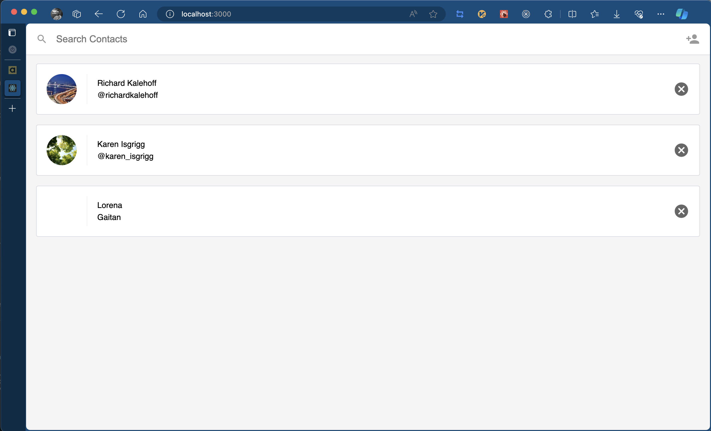

💆‍♂️ Contacts
===========

Contacts app build with React as a playground project.

🗂️ Folder structure
-------------------

this project is composed by two parts:

- `/contacts-fe`: folder with the frontend of the application build with React. For details, please review the README file of this project.
- `/contacts-be`: folder with the backend of the application build with Node and Express. For details, please review the README file of this project.

🚀 Launch
---------

Navigate to the `/contacts-be` folder from a Terminal:

```bash
cd /contacts-be
```

Install the project dependencies with yarn:

```bash
yarn install
```

Run the node server with the next command:

```bash
node server.js
```

You should get the next output in your console:

```
Server listening on port 5001
```

In another Terminal navigate to `/contacts-fe` folder:

```bash
cd /contacts-fe
```

Install the project dependencies with yarn:

```bash
yarn install
```

Run the frontend  server with the next command:

```
yarn run start
```

You should get the next view in the `localhost:3000` of your browser:


