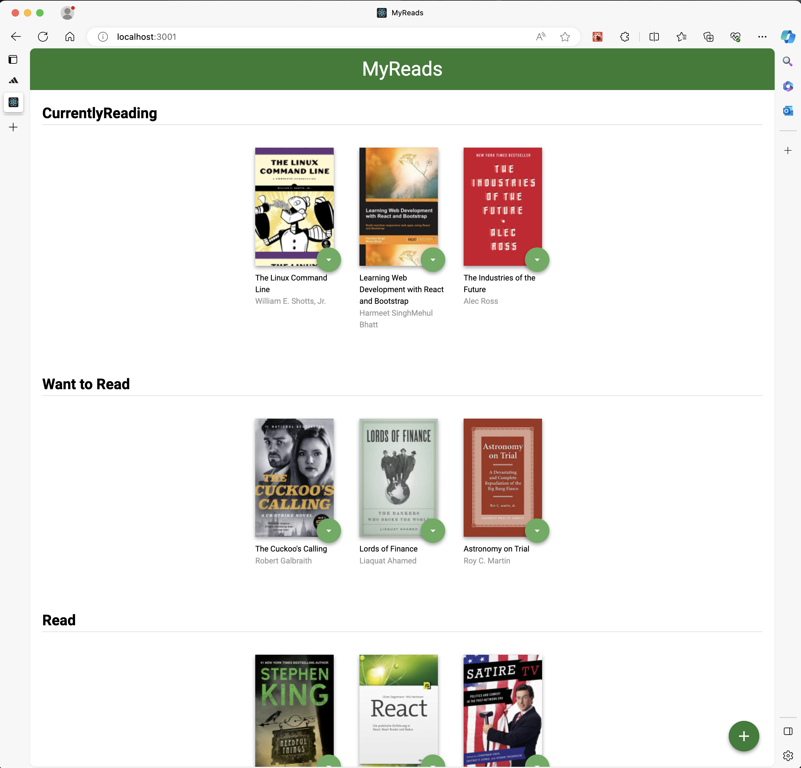

📓 MyReads
===========================

Developing a large project is hard. Don't just dive in and try to tackle the entire thing all at once. As the famous saying goes:

> A goal without a plan is just a wish.

Start with a plan! Here are some steps that I like to follow when building a project:

- Outline the steps needed to build the project
- Draw the application
  - What individual screens would look like
  - How the Components are connected to each other
- Write down the architecture
- Develop the app piece by piece

And just before submitting:

- Squash all bugs
- Check the rubric and make sure that your project meets all requirements

Take it slow and practice your newly acquired skills. This is my final assessment project for Udacity's React Fundamentals course.

🧰 Tech stack
------------

- npm v9.
- React v16 + JavaScript

🚀 Run the project
------------------

The zip file not have the `node_modules` folder. So, to run the project please execute:

1. `npm i`
2. `yarn start` or `npm run start`

You should get the next view when navigate localhost:3000 in your browser:



👀 Project Overview
-------------------

In the MyReads project, you'll create a bookshelf app that allows you to select and categorize books you have read, are currently reading, or want to read. The project emphasizes using React to build the application and provides an API server and client library that you will use to persist information as you interact with the application.

In this application, the main page displays a list of "shelves" (i.e. categories), each of which contains a number of books. The three shelves are:

- Currently Reading
- Want to Read
- Read

Each book has a control that lets you select the shelf for that book. When you select a different shelf, the book moves there. Note that the default value for the control should always be the current shelf the book is in.

The main page also has a link to /search, a search page that allows you to find books to add to your library.

The search page has a text input that may be used to find books. As the value of the text input changes, the books that match that query are displayed on the page, along with a control that lets you add the book to your library. To keep the interface consistent, you may consider re-using some of the code you used to display the books on the main page.

When a book is on a bookshelf, it should have the same state on both the main application page and the search page.

The search page also has a link to / (the root URL), which leads back to the main page.

When you navigate back to the main page from the search page, you should instantly see all of the selections you made on the search page in your library.

🧩 Components
-------------

- `<Booklist />` Stateless Component that represent a list of books. Sort the books in their respective shelf.
- `<Bookshelf />` Stateless Component that represent a bookshelf.
- `<Book />`, Stateless Component that represent a book with a title, an author and a cover.
- `<Search />` Statefull Component that retrieve the query a executes the search.
- `<Shelfchanger />` Statless Component that handle the event to change the book shelf

🎋 Hierarchy components
-----------------------

```js
    <App>
        <Booklist>
            <Bookshelf> // x3
                <Book>
                    <Shelfchanger>
                    <Shelfchanger />
                <Book />
            <Bookshelf />
        <Booklist />
        <Search>
            <Book>
                <Shelfchanger>
                <Shelfchanger />
            <Book />
        <Search />
    <App />
```

💥 Events
---------

- `onChangeBookshelf`: change a book shelf
- `onInputChangeEvent`: retrieve the query to execute the search.
