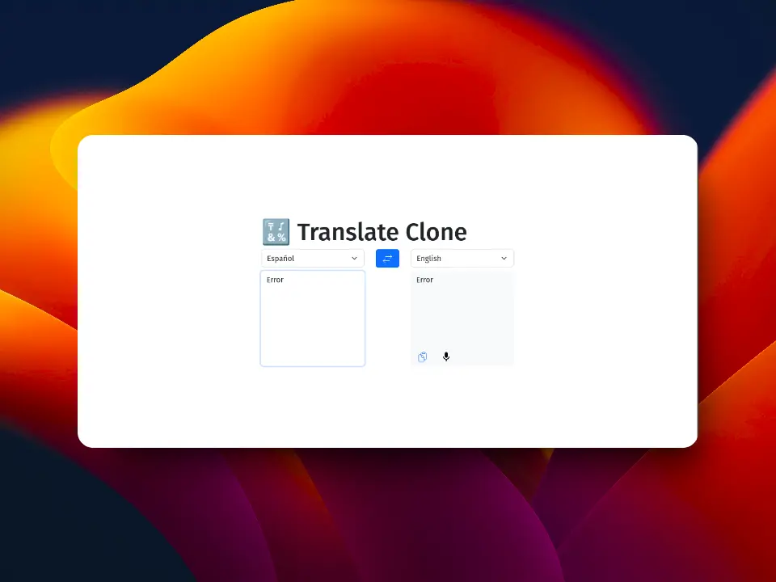

🔣 Translate Clone
==================

Proyecto que consume Open AI para traducir palabras:

🧰 Tech stack
-------------

- React v16 + TypeScript.
- React Bootstrap for styles.
- Open AI account to use with v3.2.1 to use their API.
- Web Speech API to the speaker.

🧪 Test stack
-------------

- Vitest. TEst library.
- Happy DOM, to simulate the DOM.
- Testing Library

🤓 Debounce
------------

Un debounce es un valor que espera un tiempo para ser cambiado. Se suele usar en casos como la escritura de un texto para evitar hacer el envío de una petición cada vez que el usuario pulsa una tecla. Por ejemplo, esta sería la línea del tiempo de comó se comporta el usuario:

|Momento| Acción |
|-------|-------"|
| 0ms | usuario presiona "h"|
| 0ms | se ejecuta el `useEffect` |
| 150ms| usuario presiona "o"|
| 150ms | se ejecuta el `clearTimeout` |
| 650ms | se ejecuta el `setDobouncedValaue` |
