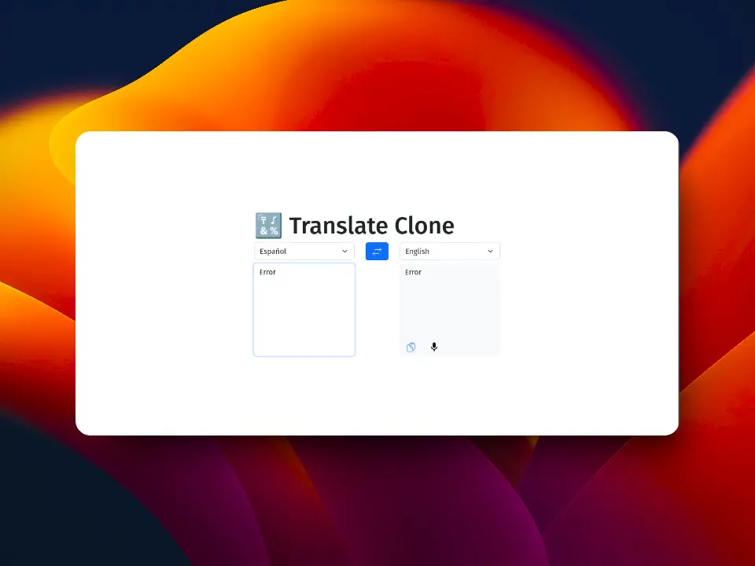

# 🔣 Translate Clone

[](https://reactjs.org/)
[](https://www.typescriptlang.org/)
[](https://platform.openai.com/)
[](https://vitejs.dev/)
[](https://vitest.dev/)

Aplicación de traducción que consume la API de OpenAI (GPT-3.5-Turbo) con pocos ejemplos (*few-shot prompting*), sintetizador de voz mediante Web Speech API y debounce para optimizar las llamadas al servicio.



---

## 💡 Propuesta de Valor

Este proyecto demuestra la integración de una API de IA generativa en el frontend sin intermediarios backend. Expone patrones clave del ecosistema React moderno: `useReducer` para estado complejo, `useDebounce` genérico para diferir efectos costosos, y componentes tipados con uniones discriminadas.

Conceptos implementados:

- Traducción con pocos ejemplos (*few-shot*) usando `gpt-3.5-turbo` vía OpenAI SDK v3.2.1
- Debounce genérico (`useDebounce<T>`) configurable por tiempo de espera
- Reducer con acciones discriminadas (`INTERCHANGE_LANGUAGES`, `SET_FROM_LANGUAGE`, `SET_TO_LANGUAGE`, `SET_FROM_TEXT`, `SET_RESULT`)
- Síntesis de voz con `SpeechSynthesisUtterance` (Web Speech API)
- Copia al portapapeles vía `navigator.clipboard.writeText()`
- Componentes con *props* tipadas mediante uniones discriminadas (`SectionType.From` / `SectionType.To`)
- Test con Vitest + Testing Library + happy-dom simulando el flujo completo de usuario

---

## 📦 Instalación

```bash
cd projects/07-translate-clone
npm install
```

Se requiere una clave de API de OpenAI. Crear un archivo `.env` en la raíz del proyecto:

```env
VITE_OPENAI_API_KEY=sk-...
```

---

## 🚀 Uso

```bash
npm run dev      # Servidor de desarrollo en http://localhost:5173
npm run build    # Compilación de producción (tsc && vite build)
npm run preview  # Previsualizar build de producción
npm run lint     # ESLint con reporte de directivas no usadas
npm test         # Ejecutar tests con Vitest
```

---

## 📁 Estructura del Proyecto

```
src/
├── main.tsx                    # Punto de entrada React 18 (createRoot)
├── App.tsx                     # Componente raíz, orquestación de hooks y layout
├── App.css / index.css         # Estilos globales y del contenedor
├── constants.ts                # Idiomas soportados y mapeos de voz
├── types.d.ts                  # Tipos: State, Action, SectionType, FromLanguage
├── components/
│   ├── Icons.tsx               # Iconos SVG: SwapIcon, ClipboardIcon, MicrophoneIcon
│   ├── LanguageSelector.tsx    # Selector de idioma con uniones discriminadas
│   └── TextArea.tsx            # Área de texto de entrada/salida
├── hook/
│   ├── useStore.ts             # useReducer con acciones tipadas
│   └── useDebounce.ts          # Hook genérico de debounce
├── services/
│   └── translate.ts            # Cliente OpenAI con few-shot prompting
└── App.test.tsx                # Test de integración del flujo de traducción
```

---

## 🔄 Flujo de Datos

1. El usuario escribe en el `TextArea` de origen (`type="From"`).
2. `setFromText` despacha `SET_FROM_TEXT` → `loading = true`, `result = ''`.
3. `useDebounce(fromText, 250)` espera 250 ms de inactividad antes de actualizar `debouncedFromText`.
4. Un `useEffect` dependiente de `[debouncedFromText, fromLanguage, toLanguage]` invoca `translate()`.
5. `translate()` construye un prompt con pocos ejemplos y llama a `openai.createChatCompletion()`.
6. Al recibir la respuesta: `setResult(resultado)` despacha `SET_RESULT` → `result = traducción`, `loading = false`.
7. El usuario puede intercambiar idiomas, copiar el resultado al portapapeles o escuchar la traducción con el sintetizador de voz.

---

## 🤖 API de Traducción

El servicio `translate()` en `src/services/translate.ts`:

- **Modelo:** `gpt-3.5-turbo`
- **Prompt del sistema:** instruye al modelo a actuar como traductor puro, sin responder preguntas.
- **Formato del mensaje:** `{texto} {{idioma_origen}} [[idioma_destino]]`
- **Ejemplos incluidos (*few-shot*):**
  - `Hola mundo {{Español}} [[English]]` → `Hello world`
  - `How are you? {{auto}} [[Português]]` → `Como você está?`
- **Cortocircuito:** si `fromLanguage === toLanguage`, devuelve el texto sin llamar a la API.

---

## ⏱️ Mecanismo de Debounce

`useDebounce<T>(value, delay = 500)` difiere la actualización del valor hasta que éste permanece estable durante `delay` ms. Cada cambio de `value` cancela el temporizador anterior y crea uno nuevo. La aplicación usa `delay = 250` ms para encontrar un equilibrio entre latencia percibida y eficiencia.

| Momento | Acción |
|---|---|
| 0 ms | Usuario presiona "h" |
| 0 ms | `useEffect` del debounce inicia temporizador de 250 ms |
| 150 ms | Usuario presiona "o" |
| 150 ms | `clearTimeout` cancela el temporizador anterior e inicia uno nuevo |
| 400 ms | El temporizador expira, `debouncedValue` se actualiza y dispara la traducción |

---

## 📚 Dependencias

| Paquete | Versión | Uso |
|---|---|---|
| `react` | ^18.2.0 | Biblioteca de componentes |
| `react-dom` | ^18.2.0 | Renderizado del DOM |
| `openai` | 3.2.1 | Cliente de la API de OpenAI |
| `bootstrap` | 5.3.2 | Estilos base |
| `react-bootstrap` | 2.10.0 | Componentes React (Container, Row, Col, Button, Form, Stack) |
| `vite` | ^5.0.8 | Empaquetador y servidor de desarrollo |
| `vitest` | ^1.2.2 | Framework de testing |
| `happy-dom` | ^13.3.8 | Entorno de DOM para tests |
| `@testing-library/react` | ^14.2.0 | Utilidades de testing para React |
| `typescript` | ^5.3.3 | Tipado estático |

---

## ⚙️ Configuración

| Archivo | Propósito |
|---|---|
| `.env` | Define `VITE_OPENAI_API_KEY` con la clave de API de OpenAI (requerido, no incluido en el repositorio) |
| `vite.config.ts` | Configuración de Vite: plugin `@vitejs/plugin-react-swc`, entorno de test `happy-dom` |
| `tsconfig.json` | TypeScript estricto con `moduleResolution: bundler`, target `ES2020`, JSX `react-jsx` |
| `.eslintrc.cjs` | ESLint con `standard-with-typescript`, plugins para React hooks y refresh |

### Variables de Entorno

| Variable | Requerida | Descripción |
|---|---|---|
| `VITE_OPENAI_API_KEY` | Sí | Clave de API de OpenAI para autenticar las peticiones de traducción |

---

## 🤝 Contribución

1. Haz un fork del repositorio.
2. Crea una rama (`git checkout -b feature/nueva-funcionalidad`).
3. Realiza los cambios siguiendo las convenciones del proyecto (TypeScript estricto, hooks personalizados, componentes con uniones discriminadas).
4. Ejecuta `npm run lint` y `npm test` antes de commitear.
5. Haz push y abre un pull request.
