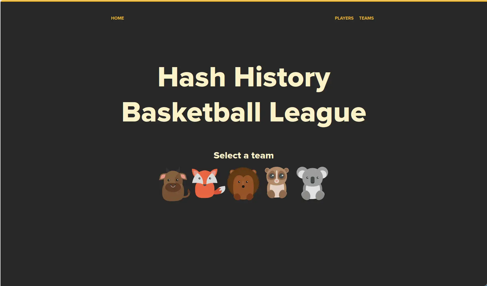
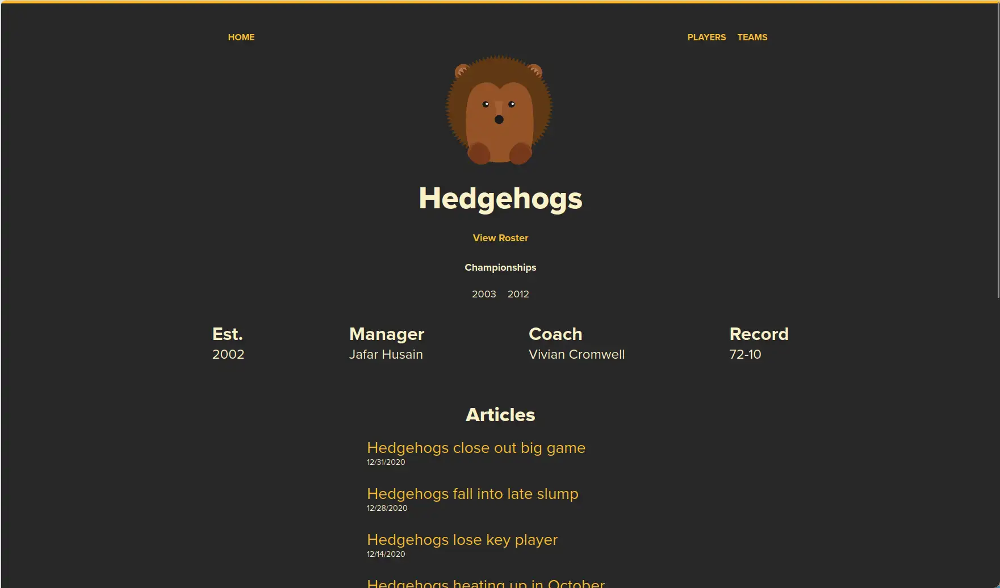
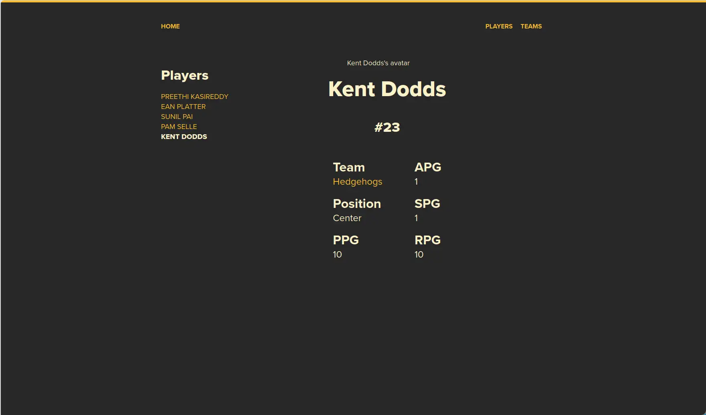
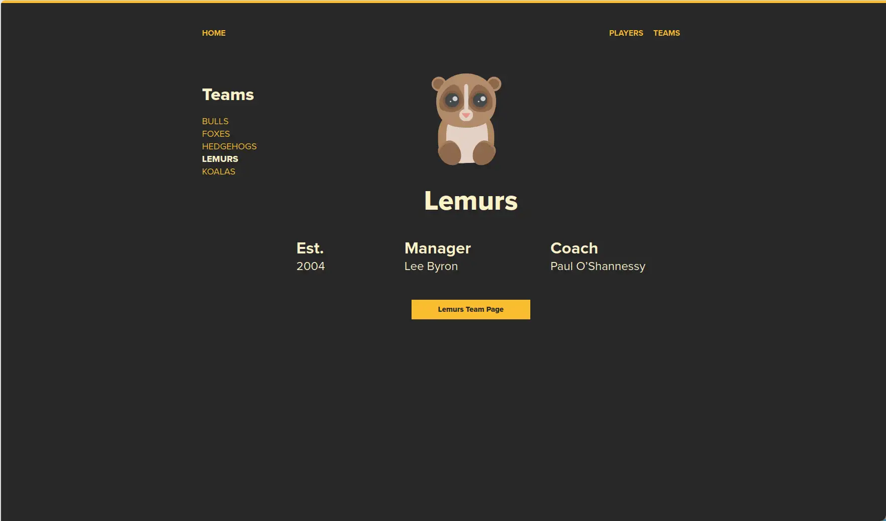
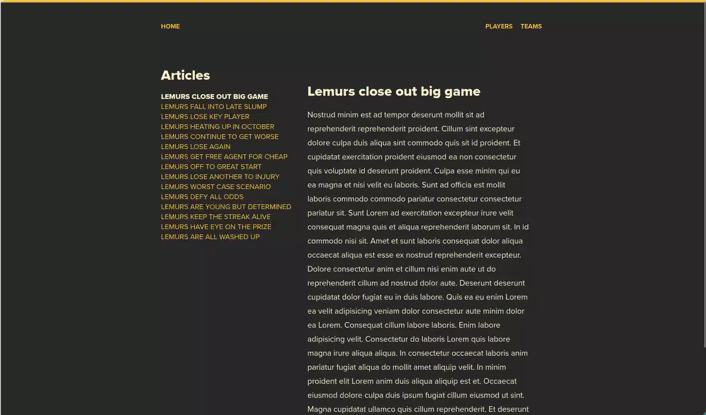

# 🏀 Hash History Basketball League

[](https://reactjs.org/)
[](https://reactrouter.com/)
[](./LICENSE)

A fictional basketball league browser built to demonstrate React Router v6 patterns: nested routes, dynamic segments, query parameters, and `<Outlet>`-based layouts.

---

## 💹 Value Proposition

This application serves as a reference implementation of React Router v6 in a data-driven single-page application. It consumes a REST API to display teams, players, and articles with deeply nested routing — no global state manager, no UI framework, just React and React Router.

Key concepts demonstrated:

- Nested route trees with `<Routes>`, `<Route>`, and `<Outlet>`
- Dynamic route segments (`:teamId`, `:playerId`, `:articleId`)
- Query string filtering via `useSearchParams`
- Sidebar-driven detail layouts with active-link highlighting
- Custom data-fetching hooks with `AbortController` cleanup
- Delayed loading indicators to avoid content flashes

---

## 📑 Pages







---

## 🚀 Installation

```bash
cd projects/16-hash-basketball
pnpm install
```

---

## 🧞 Usage

Start the development server:

```bash
pnpm start
```

The app serves on `http://localhost:3000` and proxies data from `https://api.ui.dev/hash-history-basketball-league`.

To create a production build:

```bash
pnpm run build
```

---

## ⚙️ Configuration

| File | Purpose |
|---|---|
| `.env` | Sets `SKIP_PREFLIGHT_CHECK=true` and `DISABLE_ESLINT_PLUGIN=true` to suppress CRA compatibility warnings |
| `package.json` | Defines dependencies, eslint config (`react-app`), and browserslist targets |
| `index.css` | Global stylesheet with CSS custom properties for theming (`--black`, `--white`, `--yellow`) |

### Environment Variables

No custom environment variables beyond the CRA defaults are required. The API endpoint is hardcoded in `src/hooks/useFetch.js`.

---

## 🚇 Route Structure

| Path | Component | Description |
|---|---|---|
| `/` | `Home` | Landing page with team logo grid |
| `/players` | `Players` | Two-column: sidebar + player detail outlet |
| `/players/:playerId` | `Player` | Individual player stats and bio |
| `/teams` | `Teams` | Two-column: sidebar + team detail outlet |
| `/teams/:teamId` | `Team` | Team summary with link to full team page |
| `/:teamId` | `TeamPage` | Full team page with roster and articles |
| `/:teamId/articles` | `Articles` | Two-column: sidebar + article outlet |
| `/:teamId/articles/:articleId` | `Article` | Full article content |

---

## 📊 Data Layer

All data fetches go through a single `useFetch` hook that constructs requests to the external API. Higher-level hooks (`useTeam`, `usePlayers`, `useArticle`, etc.) encapsulate specific endpoints.

- **Double JSON parsing**: The API wraps response bodies as strings inside `{ body: "..." }`.
- **AbortController**: In-flight requests are cancelled on dependency change or component unmount.
- **POST semantics**: Detail endpoints use `POST` with a JSON body rather than RESTful `GET` with path parameters.

---

## 📦 Dependencies

| Package | Version | Usage |
|---|---|---|
| `react` | ^17.0.2 | Component library |
| `react-dom` | ^17.0.2 | DOM renderer |
| `react-router-dom` | ^6.0.2 | Client-side routing |
| `react-scripts` | 5.0.1 | CRA build toolchain |

---

## 💁‍♂️ Contribution

1. Fork the repository
2. Create a feature branch (`git checkout -b feature/your-feature`)
3. Commit your changes following [Conventional Commits](https://www.conventionalcommits.org/)
4. Push to your branch and open a pull request

Ensure existing routing patterns and component conventions are followed. The project uses no additional styling or state management libraries — keep dependencies minimal.
