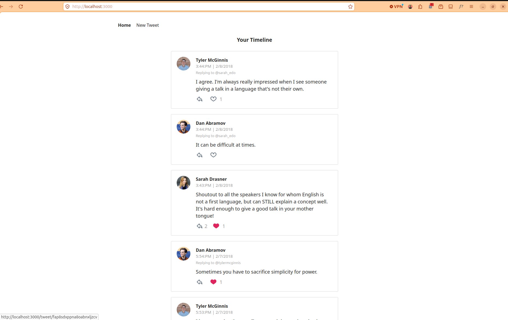
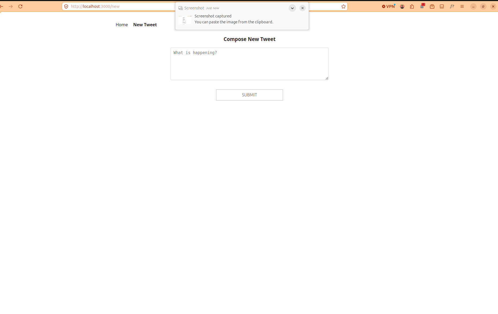
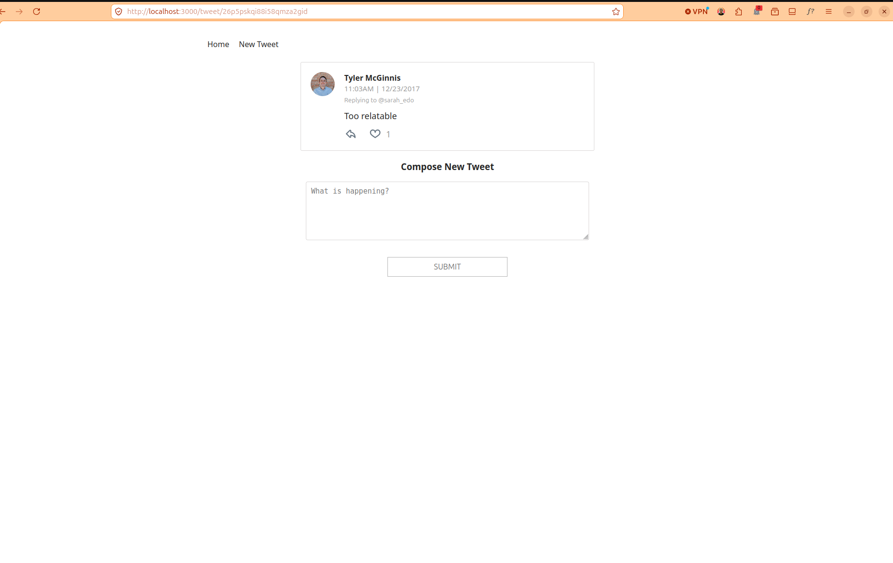

# Chirper


A client-only Twitter-like social application built with **React** and **Redux**. Users can view a chronological timeline, post new tweets, reply to existing tweets, and like/unlike tweets — all backed by a mock API with simulated latency.



---

## 🎯 Value Proposition

Chirper demonstrates a canonical React + Redux data flow pattern:

- **Single-direction data flow** — actions dispatched through Redux middleware (thunk + logger) flow into reducers that produce immutable state updates.
- **Optimistic UI updates** — likes apply instantly before the async API resolves, with rollback on failure.
- **Nested reply threading** — tweets can reference parent tweets, building a reply tree rendered on dedicated detail pages.
- **Mock backend** — an in-memory data store (`src/utils/_DATA.js`) simulates async API calls, making the app fully self-contained without a server.

---

## 📦 Installation

**Prerequisites:** Node.js >= 18 (see `.nvmrc`).

```bash
npm install
```

---

## 🚀 Usage

| Command           | Description                         |
| ----------------- | ----------------------------------- |
| `npm run dev`     | Start dev server (port 3000)        |
| `npm run build`   | Production build to `dist/`         |
| `npm run preview` | Preview the production build        |

Open `http://localhost:3000` after starting the dev server. The app loads with a pre-authenticated user (Tyler McGinnis) and a timeline of seeded tweets.

### Features

- **Timeline** (`/`) — chronologically sorted list of all tweets.
- **Tweet Detail** (`/tweet/:id`) — individual tweet view, reply form, and threaded replies.
- **New Tweet** (`/new`) — compose a tweet with a 280-character limit and live character counter.
- **Likes** — heart icon toggles like/unlike with optimistic rendering.
- **Replies** — inline reply button navigates to the tweet detail page for a threaded response.





---

## ⚙️ Configuration

### Dev Server

Edit `vite.config.js` to change the port or disable auto-open:

```js
export default defineConfig({
  plugins: [react()],
  server: {
    port: 3000,
    open: true   // set false to disable browser auto-open
  }
})
```

### Authenticated User

The hardcoded authenticated user is set in `src/actions/shared.js`:

```js
const AUTHED_ID = 'tylermcginnis'
```

Change this to `'sarah_edo'` or `'dan_abramov'` to test as a different user.

### Mock Data

Seed users and tweets live in `src/utils/_DATA.js`. The data is reset on each page reload. To extend, add new entries to the `users` and `tweets` objects.

---

## 🤝 Contributing

1. Fork the repository.
2. Create a feature branch (`git checkout -b feature/your-feature`).
3. Commit changes (`git commit -m 'Add some feature'`).
4. Push to the branch (`git push origin feature/your-feature`).
5. Open a Pull Request.

### Guidelines

- Maintain the existing Redux action/reducer pattern for state changes.
- Keep components functionally pure where possible; use local state only for UI concerns (form input, toggles).
- Add mock data entries to `_DATA.js` when introducing new entities.
- Ensure the app runs without console errors before submitting.
