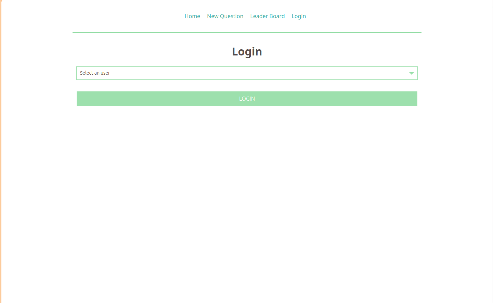
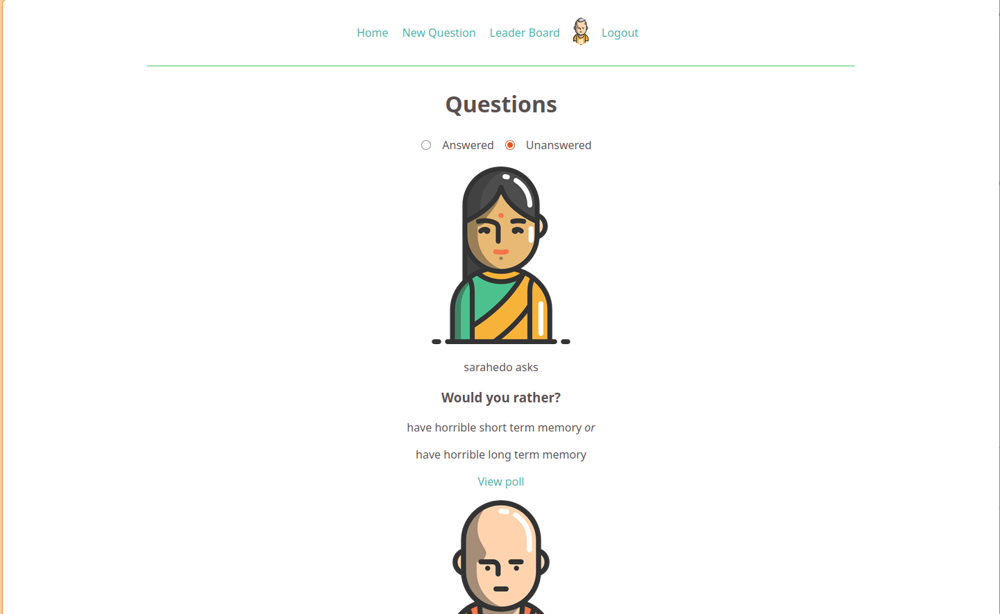
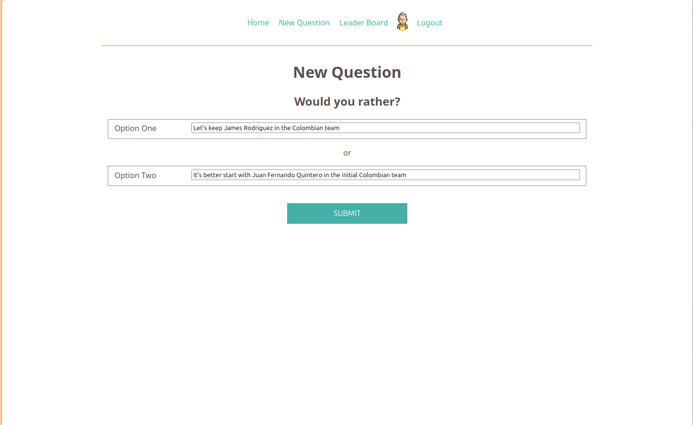
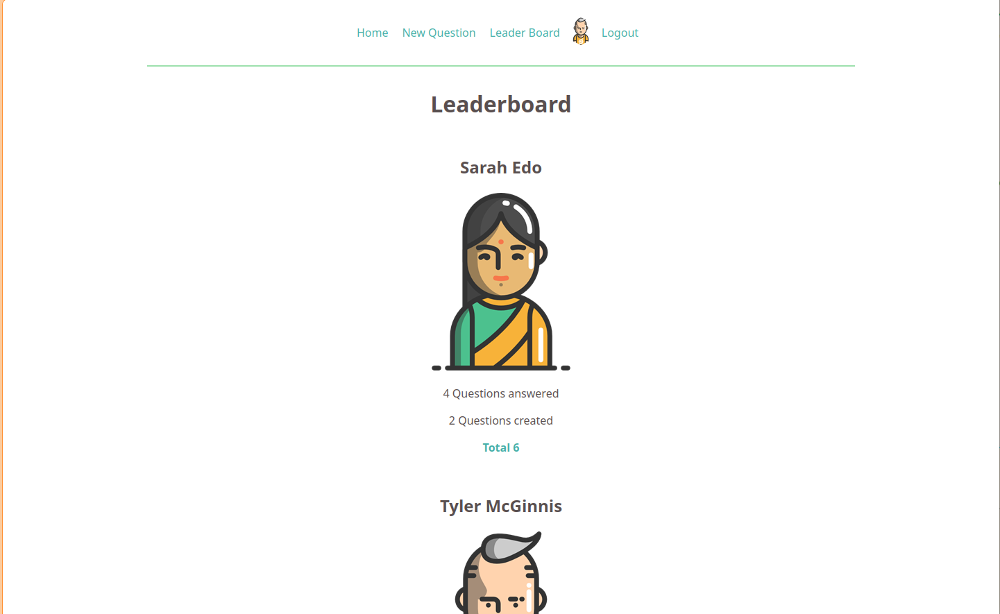

# Would You Rather?

[](https://reactjs.org/)
[](https://redux.js.org/)
[](https://vitejs.dev/)
[](https://pnpm.io/)

A **"Would You Rather?"** polling game built with React and Redux. Users log in, vote on two-option questions, create new polls, and compete on a leaderboard ranked by total activity (questions answered + created). Final assessment project for Udacity's React & Redux Nanodegree.

---

## Value Proposition

- **Authentication flow** — login screen enforces access control; unauthenticated users are redirected.
- **Poll lifecycle** — view unanswered polls (radio vote), see live results with vote counts and percentages, and create new two-option questions.
- **Leaderboard** — users are ranked by combined score: number of answers plus number of questions authored.
- **State management** — Redux store with `redux-thunk` middleware for async actions and a custom logger for debugging.
- **Mock backend** — in-memory data layer (`_DATA.js`) simulates REST API responses with configurable latency.

---

## Screenshots

| Login | Home | New Question | Leaderboard |
|---|---|---|---|
|  |  |  |  |

---

## Installation

**Prerequisites:** [Node.js](https://nodejs.org/) >= 18 and [pnpm](https://pnpm.io/installation) >= 8.

```bash
# Clone and enter the project directory
cd projects/18-would-you-rather

# Install dependencies
pnpm install
```

---

## Usage

| Command | Description |
|---|---|
| `pnpm start` | Start the Vite dev server (defaults to `http://localhost:3000`) |
| `pnpm run dev` | Alias for `pnpm start` |
| `pnpm run build` | Production build output to `dist/` |
| `pnpm run preview` | Preview the production build locally |

The app ships with three pre-seeded users:

| User ID | Avatar |
|---|---|
| `sarahedo` | Sarah Edo |
| `tylermcginnis` | Tyler McGinnis |
| `johndoe` | John Doe |

Select any user from the login dropdown to begin.

---

## Project Structure

```
src/
├── index.jsx                 Entry point — mounts <App /> into #root
├── App.jsx                   Root component: Router, Nav, Routes, initial data dispatch
├── index.css                 Global styles and CSS custom properties
├── components/
│   ├── index.js              Barrel exports for all components
│   ├── 404/
│   │   ├── 404.component.jsx
│   │   └── 404.styles.css
│   ├── Leaderboard/
│   │   ├── Leaderboard.component.jsx
│   │   └── Leaderboard.styles.css
│   ├── Login/
│   │   ├── Login.component.jsx
│   │   └── Login.styles.css
│   ├── Nav/
│   │   ├── Nav.component.jsx
│   │   └── Nav.styles.css
│   ├── PrivateRoute/
│   │   └── PrivateRoute.component.jsx
│   ├── Question/
│   │   ├── NewQuestion.component.jsx
│   │   ├── NewQuestion.styles.css
│   │   ├── Question.component.jsx
│   │   ├── QuestionOptions.component.jsx
│   │   ├── QuestionOptions.styles.css
│   │   ├── QuestionResults.component.jsx
│   │   └── QuestionResults.styles.css
│   └── Questions/
│       ├── Questions.component.jsx
│       └── Questions.styles.css
├── redux/
│   ├── actions/
│   │   ├── authedUser.action.js
│   │   ├── questions.action.js
│   │   ├── shared.js
│   │   ├── types.action.js
│   │   └── users.action.js
│   ├── middleware/
│   │   ├── index.js
│   │   └── logger.middleware.js
│   └── reducers/
│       ├── authedUser.reducer.js
│       ├── index.js
│       ├── questions.reducer.js
│       └── users.reducer.js
└── utils/
    ├── _DATA.js              Mock database (users, questions, async operations)
    ├── api.js                Promise-based API wrapper over _DATA.js
    └── README.md             Data model reference
```

---

## Component Architecture

```
<App>
  <LoadingBar />
  <Nav>
    ( Home | New Question | Leaderboard | Login/Logout )
  </Nav>
  <Switch>
    <Route path="/" exact>           → <Questions />
    <Route path="/question/:id">     → <Question /> → <QuestionOptions /> | <QuestionResults />
    <Route path="/add">              → <NewQuestion />
    <Route path="/leaderboard">      → <Leaderboard />
    <Route path="/login">            → <Login />
    <Route path="*">                 → <PageNotFound />
  </Switch>
</App>
```

**Private routes** (`/`, `/add`, `/leaderboard`, `/question/:id`) are wrapped in `<PrivateRoute />`, which redirects unauthenticated users to `/login`.

---

## Redux State Shape

```javascript
{
  authedUser: { user: "sarahedo" } | null,
  users: {
    "sarahedo": { id, name, avatarURL, answers: {...}, questions: [...] },
    "tylermcginnis": { ... },
    "johndoe": { ... }
  },
  questions: {
    "8xf0y6zi...": { id, author, timestamp, optionOne: { votes, text }, optionTwo: { votes, text } },
    ...
  },
  loadingBar: { /* managed by react-redux-loading */ }
}
```

### Action Types

| Type | Dispatched By |
|---|---|
| `LOG_IN` | `handleLogInUser(user)` — sets `authedUser` |
| `LOG_OUT` | `handleLogOutUser()` — clears `authedUser` |
| `GET_QUESTIONS` | `handleInitialData()` — populates all questions |
| `ADD_QUESTION` | `handleAddQuestion(opt1, opt2)` — inserts a new poll |
| `SAVE_VOTE` | `handleSaveVote({ qid, option })` — records a vote |
| `GET_USERS` | `handleInitialData()` — populates all users |

---

## Data Layer

The file `src/utils/_DATA.js` serves as an in-memory mock database with four async operations (all simulate network latency via `setTimeout`):

| Function | Returns |
|---|---|
| `_getUsers()` | `{ [id]: User }` |
| `_getQuestions()` | `{ [id]: Question }` |
| `_saveQuestion({ author, optionOneText, optionTwoText })` | Formatted `Question` object |
| `_saveQuestionAnswer({ authedUser, qid, answer })` | `void` |
| `_saveUser(user)` | `{ user: id }` |

The `api.js` module wraps these into a clean promise-based interface used by Redux thunks.

---

## Configuration

The Vite dev server configuration lives in `vite.config.js`:

```js
import { defineConfig } from 'vite'
import react from '@vitejs/plugin-react'

export default defineConfig({
  plugins: [react()],
  server: {
    port: 3000,
    open: true
  }
})
```

- **Port**: defaults to `3000`. Change `server.port` to use a different port.
- **Auto-open**: the browser opens automatically on start. Set `open: false` to disable.
- **JSX transform**: handled by `@vitejs/plugin-react` — no Babel configuration required.

Static assets (favicon, manifest, screenshots) live in `public/` and are served at the root path.

---

## Contribution Guidelines

1. Fork the repository and create a feature branch.
2. Follow the existing code conventions:
   - Class components with Redux `connect` for all container components.
   - Co-located stylesheets (`*.styles.css`) imported alongside each component.
   - `pnpm` for dependency management — run `pnpm install` to sync lockfile changes.
3. Use `pnpm run build` to verify there are no compilation errors before submitting a pull request.
4. Keep pull requests focused on a single feature or fix.
