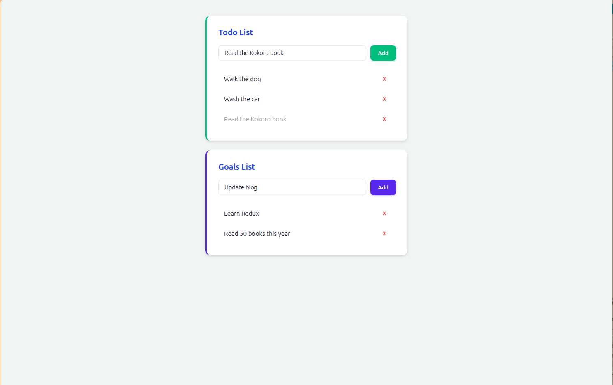

# Todo & Goals App

[](https://reactjs.org/)
[](https://redux.js.org/)
[](https://vitejs.dev/)
[](https://pnpm.io/)

A **Todo & Goals** manager built with React and Redux. Add, toggle, and remove todos alongside persistent goals, all backed by a mock API with optimistic updates.



---

## 💎 Value Proposition

- **Dual-list management** — separate Todo and Goals sections, each with independent CRUD operations.
- **Optimistic updates** — UI updates immediately on add/delete/toggle; rolls back gracefully on API failure.
- **Custom middleware pipeline** — `redux-thunk` for async actions, a `checker` that blocks "bitcoin" items, and a `logger` that traces every state mutation.
- **Rails-style folder structure** — actions, reducers, middleware, and components in dedicated directories for clear separation of concerns.
- **Minimalistic UI** — gradient-inspired color palette, smooth slide-in/slide-out animations, and responsive card layout.

---

## 📦 Installation

**Prerequisites:** [Node.js](https://nodejs.org/) >= 18 and [pnpm](https://pnpm.io/installation) >= 8.

```bash
cd projects/19-todo-app
pnpm install
```

---

## 🚀 Usage

| Command | Description |
|---|---|
| `pnpm start` | Start the Vite dev server on `http://localhost:3000` |
| `pnpm run dev` | Alias for `pnpm start` |
| `pnpm run build` | Production build output to `dist/` |
| `pnpm run preview` | Preview the production build locally |

---

## 🏗️ Architecture

```
src/
├── actions/          # Redux action creators & async thunks
│   ├── shared.js     # RECEIVE_DATA, handleInitialData
│   ├── todos.js      # ADD_TODO, REMOVE_TODO, TOGGLE_TODO
│   └── goals.js      # ADD_GOAL, REMOVE_GOAL
├── middleware/        # Custom Redux middleware
│   ├── checker.js     # Blocks items containing "bitcoin"
│   ├── logger.js      # Console-logs every action and resulting state
│   └── index.js       # Composes thunk + checker + logger
├── reducers/          # Redux state slices
│   ├── todos.js       # Todo list reducer
│   ├── goals.js       # Goal list reducer
│   ├── loading.js     # Tracks initial data fetch state
│   └── index.js       # combineReducers
└── components/        # React UI
    ├── App.jsx        # Root container, dispatches initial data
    ├── Todos.jsx      # Connected todo form + list
    ├── Goals.jsx      # Connected goal form + list
    └── List.jsx       # Reusable list with add/remove animations
```

### 📊 Data Flow

1. `App` dispatches `handleInitialData()` on mount, fetching todos and goals from the `goals-todos-api`.
2. `loading` reducer toggles from `true` to `false` once data arrives.
3. User actions (add, delete, toggle) dispatch thunks that hit the API and update the Redux store.
4. The `checker` middleware inspects `ADD_TODO` and `ADD_GOAL` actions, rejecting any item containing the word "bitcoin".
5. The `logger` middleware prints every dispatched action and the resulting store state to the browser console.

### 🧩 UI Components

| Component | Role | State Connection |
|---|---|---|
| `App` | Layout wrapper, data loader | `loading` |
| `Todos` | Todo form input + Add button | `todos` |
| `Goals` | Goal form input + Add button | `goals` |
| `List` | Shared presentational list | None (props: `items`, `remove`, `toggle`) |

Each `List` item supports:
- **Toggle** (todos only) — click the item text to mark complete/incomplete
- **Remove** — click the X button, triggers slide-out animation before removal
- **Enter animation** — new items slide down and fade in on mount
- **Exit animation** — removed items slide up and fade out before deletion

### ⛓️ Middleware Pipeline

```
Action → redux-thunk → checker → logger → Reducer → Store
```

| Middleware | Purpose |
|---|---|
| `redux-thunk` | Enables async action creators (API calls) |
| `checker` | Guards against unwanted items; blocks "bitcoin" todos and goals |
| `logger` | Debugging aid; logs every action type and the resulting state tree |

### 🔌 API

The app depends on the `goals-todos-api` package, which provides a mock REST backend:

| Method | Endpoint |
|---|---|
| `fetchTodos()` | GET all todos |
| `fetchGoals()` | GET all goals |
| `saveTodo(name)` | POST a new todo |
| `saveGoal(name)` | POST a new goal |
| `deleteTodo(id)` | DELETE a todo |
| `deleteGoal(id)` | DELETE a goal |
| `saveTodoToggle(id)` | PATCH toggle todo completion |

---

## ⚙️ Configuration

### ⚡ Vite

The Vite dev server is configured in `vite.config.js`:

```js
export default defineConfig({
  plugins: [react()],
  server: {
    port: 3000,
    open: true
  }
})
```

To change the port, edit the `server.port` value.

### 🌍 Environment Variables

No environment variables are required. The app uses the `goals-todos-api` mock backend by default. To connect to a real API, update the import in `src/actions/*.js` files.

---

## 🤝 Contribution

1. Fork the repository and create a feature branch.
2. Install dependencies with `pnpm install`.
3. Run the dev server with `pnpm start` to verify changes.
4. Build the production bundle with `pnpm run build` before opening a PR.
5. Follow the existing folder structure and naming conventions.
