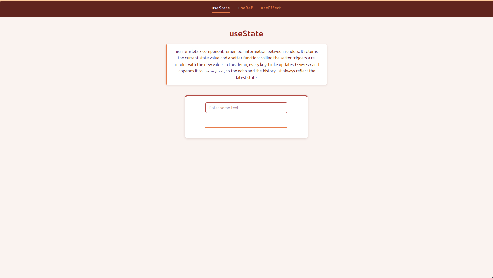
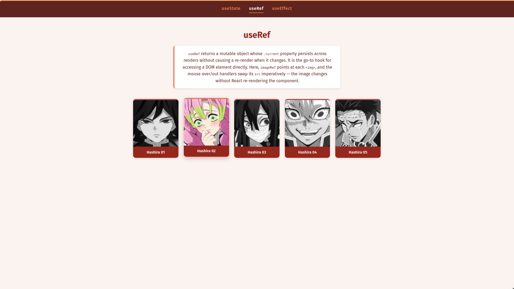
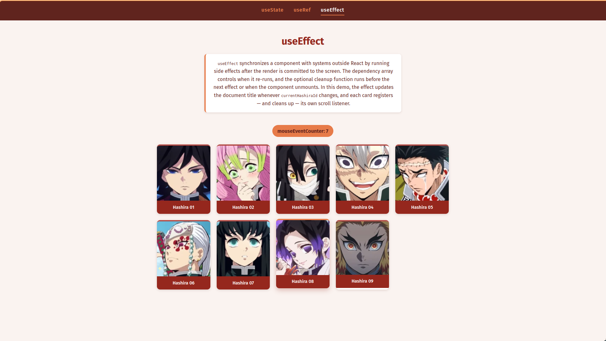

# 🪝 Understanding React Hooks


A zero-dependency playground for learning the three fundamental React
hooks — `useState`, `useRef`, and `useEffect` — through small interactive
demos. No bundler, no framework: just React, native ES modules, and a
tiny static server.

## ✨ Value Proposition

Most React setups hide the library behind a build pipeline. This project
removes that layer on purpose:

- **No build step** — React 19.2.8 is loaded in the browser through
  [import maps](https://developer.mozilla.org/en-US/docs/Web/HTML/Reference/Elements/script/type/importmap)
  pointing at esm.sh, and components are plain ES modules written with
  `React.createElement`.
- **Zero runtime dependencies** — `package.json` declares none; the dev
  server (`server.js`) uses only Node.js built-in modules.
- **One page per hook** — each demo pairs a short explanation with a
  minimal, focused example you can read end-to-end in seconds.

## 📸 Screenshots

### `useState` — input echo with history

Type in the field and watch the state update on every keystroke while a
history list accumulates previous values.



### `useRef` — image toggle on mouse over

Hover a card to swap its image imperatively through a ref, without
triggering a re-render.



### `useEffect` — image reveal on scroll

Cards render their colored image only while inside the viewport, and the
document title syncs with the hovered card.



## 🚀 Installation

Prerequisites:

- [Node.js](https://nodejs.org) ≥ 20.11 (`server.js` relies on
  `import.meta.dirname`)
- [pnpm](https://pnpm.io) (the repo pins it via the `packageManager`
  field; [Corepack](https://nodejs.org/api/corepack.html) handles this
  automatically)

This project is a package of the `react-nanodegree` pnpm workspace, so
install from the **repository root**:

```bash
git clone git@github.com:suabochica/react-nanodegree.git
cd react-nanodegree
pnpm install
```

> **Note:** an internet connection is required while developing — React
> is fetched from esm.sh and the Fira Sans font from Google Fonts at
> page load.

## 🧭 Usage

Start the dev server from this directory:

```bash
pnpm dev
```

Then open one of the demo pages:

| Route                          | Hook        | Demo                                    |
| ------------------------------ | ----------- | --------------------------------------- |
| http://localhost:3000              | `useState`  | Controlled input with echo and history  |
| http://localhost:3000/mouse-over.html | `useRef`    | B/W → color image swap on hover         |
| http://localhost:3000/scroll.html     | `useEffect` | Viewport-aware image reveal on scroll   |

## ⚙️ Configuration

| What              | Where                                                            |
| ----------------- | ---------------------------------------------------------------- |
| Server port       | `PORT` environment variable (default `3000`), e.g. `PORT=8080 pnpm dev` |
| React version     | Import map pinned in each HTML file (`https://esm.sh/react@19.2.8`)     |
| Color palette     | CSS custom properties in `:root` inside `styles.css`                    |
| Typography        | Google Fonts link (Fira Sans) in the `<head>` of each HTML page         |

## 📁 Project Structure

```text
21-hooks/
├── index.html                  # useState page
├── mouse-over.html             # useRef page
├── scroll.html                 # useEffect page
├── server.js                   # Zero-dependency static file server
├── styles.css                  # Shared theme (palette, cards, layout)
├── src/
│   ├── InputElement.js         # useState demo component
│   ├── ImageChangeOnMouseOver.js
│   ├── ImageToggleOnMouseOver.js
│   ├── ImageChangeOnScroll.js
│   └── ImageToggleOnScroll.js
├── static/                     # bw/ and color/ demo images (.webp)
└── public/                     # Screenshots used in this README
```

## 🤝 Contribution Guidelines

Contributions are welcome. To keep the project coherent:

1. Fork the repository and create a feature branch from `master`.
2. Respect the **no-build constraint**: components must remain valid
   browser ES modules — no JSX, no transpiler-specific syntax.
3. Follow the [Conventional Commits](https://www.conventionalcommits.org)
   style used in the repository history (e.g. `feat: Add useMemo demo page`).
4. Run `pnpm dev` and verify all three pages render without console
   errors before opening a pull request.

## 📄 License

This project is licensed under the [ISC License](LICENSE).
