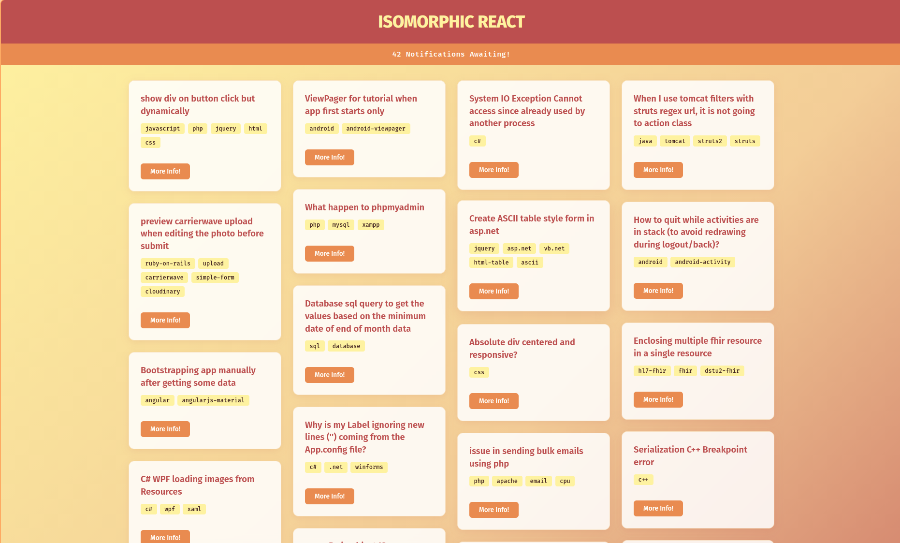
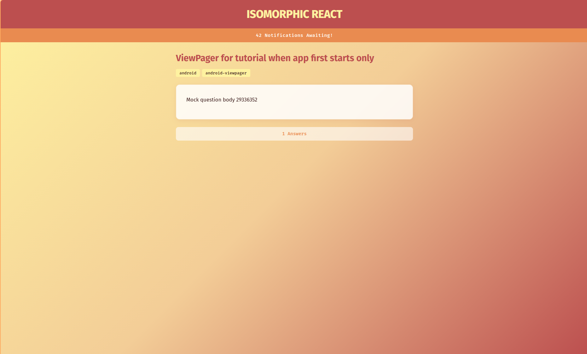

# Isomorphic React

[](LICENSE)
[](https://reactjs.org/)
[](https://nodejs.org/)

Takeaways and practical project of the course [Isomorphic React](https://app.pluralsight.com/library/courses/isomorphic-react/table-of-contents) by Daniel Stern.

## 🧭 About

A universal (isomorphic) React application that pre-renders HTML on the server via Express and hydrates the client bundle for SPA navigation. Data is fetched from the Stack Overflow API or a local mock, managed through Redux and Redux Saga, and routed with React Router across both environments.

## 🖼 Screenshots

| Home — Masonry Grid | Notifications |
|---------------------|---------------|
|  |  |

## 🏗 Architecture

| Layer | Technology |
|-------|------------|
| Runtime | Node.js 24.15, pnpm workspace |
| Bundler | Webpack 5 + Babel 7 |
| Server | Express with generator-based middleware |
| State | Redux 3 + Redux Saga 0.15 |
| Routing | React Router 4 (browser + memory history) |
| Styling | CSS with masonry grid, Fira Sans/Code |
| Testing | Jest + React Test Renderer |

## 🚀 Getting Started

```bash
git clone https://github.com/suabochica/isomorphic-react.git
cd isomorphic-react
pnpm install
```

### Development

```bash
pnpm dev
```

Starts the server with hot module replacement, mock data, and server-side rendering enabled. Open http://localhost:3000.

### Production

```bash
pnpm start
```

Builds the client bundle with Webpack in production mode, then starts the server with live Stack Overflow data and SSR.

### Testing

```bash
pnpm test
```

## ⚙️ Configuration

Server flags (passed via `cross-env` in package scripts):

| Flag | Type | Description |
|------|------|-------------|
| `--useLiveData` | `"true"` / `"false"` | Toggle between live API and local mock data |
| `--useServerRender` | `"true"` / `"false"` | Enable or disable server-side rendering |

Environment variables:

| Variable | Default | Description |
|----------|---------|-------------|
| `NODE_ENV` | — | `development` activates HMR middleware; `production` serves static assets from `/dist` |
| `PORT` | `3000` | Server listen port |

## 🖌 Styling

The UI uses a masonry CSS grid for the question listing, glassmorphism cards, and a warm earth palette:

| Color | Hex |
|-------|-----|
| Yellow | `#FEF2A0` |
| Peach | `#F3CD97` |
| Orange | `#E98B50` |
| Burgundy | `#BC4F4F` |

Typography uses [Fira Sans](https://fonts.google.com/specimen/Fira+Sans) for headings and body (weights 300–800) and [Fira Code](https://fonts.google.com/specimen/Fira+Code) for monospace elements (weights 400–700).

## 📁 Project Structure

```
src/
  App.jsx              Root component and routes
  index.jsx            Client entry point (hydration)
  getStore.js          Redux store factory
  styles.css           Global styles
  components/
    QuestionList.jsx    Masonry question grid
    QuestionDetail.jsx  Single question view
    NotificationViewer.jsx
    TagsList.jsx
  reducers/
    questions.js        Question state reducer
  sagas/
    fetch-questions-saga.js
    fetch-question-saga.js
  services/
    NotificationService.js
server/
  index.jsx            Express server with SSR and API routes
public/
  index.html           HTML template for SSR
  01-home.png           Home page screenshot
  02-notification.png   Notification bar screenshot
data/
  api-real-url.js      Stack Overflow API endpoint config
  mock-questions.json  Local question fixture
```

## 🔄 Data Flow

1. Browser requests a route (e.g. `/` or `/questions/:id`)
2. Express matches the route, fetches data from the API or mock
3. Redux store is seeded with the fetched initial state
4. React renders the component tree to an HTML string on the server
5. The string replaces the `<%= preloadedApplication %>` placeholder in the template
6. The browser displays pre-rendered HTML instantly
7. The client bundle loads and hydrates the existing DOM
8. Subsequent navigation is handled client-side by React Router and Redux Saga

## 📄 License

ISC
