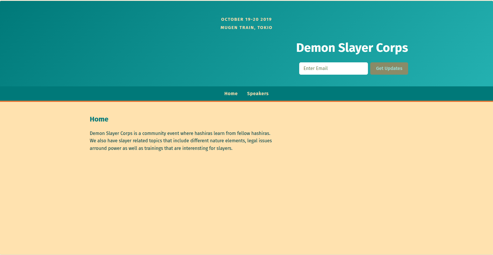
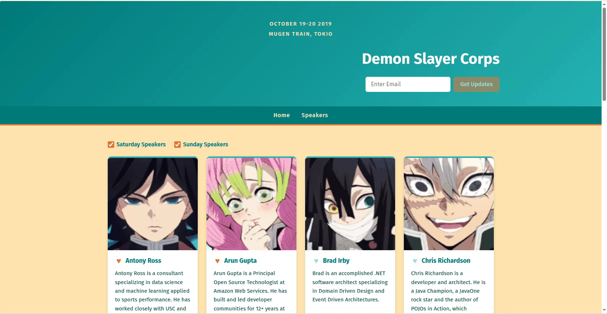

# React Conf App


## 🎯 Value Proposition

React app to explore hooks — no bundler, no framework. React 19 is loaded in
the browser through import maps pointing at esm.sh, components are plain ES
modules written with `React.createElement` (no JSX, no build step), and
`server.js` is a tiny static file server built on Node.js core modules.

The app renders a fictional conference site ("Demon Slayer Corps") and
demonstrates the core React hooks in a minimal, dependency-free setup:

- `useState` — day filters, favorite toggles, and loading state in the
  Speakers page.
- `useEffect` — simulated async data fetching with cleanup.
- `useRef` — DOM access for the scroll-driven color/B&W image toggle in
  `ImageToggleOnScroll`.

## 📸 Screenshots

| Home | Speakers |
| ---- | -------- |
|  |  |

## 🚀 Installation

Prerequisites: [Node.js](https://nodejs.org) (18+) and
[pnpm](https://pnpm.io). This project is a package of the
`react-nanodegree` pnpm workspace.

```bash
pnpm install
```

## 📖 Usage

Start the dev server from this directory:

```bash
pnpm dev
```

Then open one of the pages:

| Route                           | Page     |
| ------------------------------- | -------- |
| http://localhost:3000           | Home     |
| http://localhost:3000/speakers.html | Speakers |

## ⚙️ Configuration

| Setting        | Where                       | Default | Description                        |
| -------------- | --------------------------- | ------- | ---------------------------------- |
| `PORT`         | Environment variable        | `3000`  | Port the static server listens on. |
| React version  | Import map in `index.html` / `speakers.html` | `19.2.8` | esm.sh URL for `react` and `react-dom/client`. |

Example: `PORT=8080 pnpm dev`

## 🗂️ Project Structure

```text
├── index.html, speakers.html   # Pages: import map + module bootstrap
├── server.js                   # Static file server (node:http, no deps)
├── public/                     # Screenshots and favicon
├── static/                     # site.css + speaker images (color/ and bw/)
└── src/
    ├── App.js                  # Page router (pageName prop)
    ├── components/             # Header, Menu, Home, SignMeUp, Speakers,
    │                           # SpeakerDetail, ImageToggleOnScroll
    └── data/SpeakersData.js    # Static speaker records
```

## 🤝 Contribution Guidelines

1. Fork the repository and create a feature branch from `main`.
2. Keep the no-bundler constraint: plain ES modules and
   `React.createElement` — do not introduce JSX or a build step.
3. Serve any new asset type by extending `MIME_TYPES` in `server.js`.
4. Optimize images before committing (WebP preferred; see `public/` and
   `static/`).
5. Open a pull request with a clear description of the change.

## 📄 License

ISC © Suabochica
