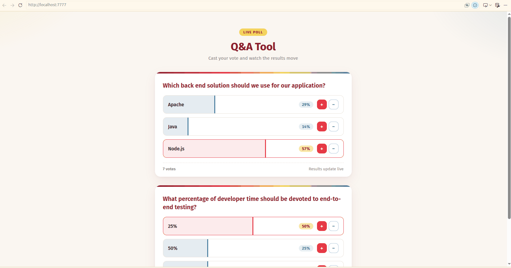

# Server Rendered Poll App

Server rendered poll app with React. Express renders the Q&A list on the
server, serves a JSON API, and handles live voting through + / - buttons.




## 🧰 Tech Stack

- Express
- Babel
- Webpack
- React

## 🚀 Server Launch

Install the dependencies (this project uses pnpm):

```
$ pnpm install
```

Build the client bundle and compile the server:

```
$ pnpm run build
```

Start the server:

```
$ pnpm start
```

The app will be available on `localhost:7777`.

> For WSL2 there is an annoying issue with the use of the localhost. Instead it
> is recomended use the `ifconfig` command get the IP address and run in the
> brwoser the URL like `http://172.27.43.127:7777`. No code changes are needed:
> the client calls the API with relative URLs.

## ✅ Steps to Test

1. Open `http://localhost:7777/` — the Q&A list is server rendered. View the
   page source to confirm the markup is inside `#container`.
2. Check the API: `curl http://localhost:7777/data` returns the questions and
   answers as JSON.
3. Vote with the + / - buttons, or directly with
   `curl "http://localhost:7777/vote/A3?increment=1"`. Run
   `curl http://localhost:7777/data` afterwards to see the updated upvotes.

## 🛠 Development

For client side development with live reload, run two terminals:

```
$ pnpm start   # terminal 1: Express on :7777 (SSR + API)
$ pnpm dev     # terminal 2: webpack-dev-server on :8080
```

Open `http://localhost:8080`. The dev server serves the client bundle from
memory, proxies `/data` and `/vote` to Express on `:7777`, and reloads the page
when files in `client/` change.

> In dev mode the page is client rendered, so React logs a hydration fallback
> warning in the console — this is expected. Server side rendering is exercised
> through the `pnpm run build` + `pnpm start` flow on `:7777`.

## ⚙️ Configuration

| Setting | Value | Where |
| --- | --- | --- |
| Express port | `7777` | `server/index.js` (`app.listen`) |
| Dev server port | `8080` | `webpack.config.js` (`devServer.port`) |
| API proxy | `/data`, `/vote` → `http://localhost:7777` | `webpack.config.js` (`devServer.proxy`) |
| Static assets | `dist/` (client bundle), `public/` (HTML/CSS, `index: false` keeps SSR on `/`) | `server/index.js` |
| Poll data | In-memory `questions`/`answers` seed; votes reset on restart | `server/index.js` |

## 🤝 Contributing

1. Fork the repository and create a feature branch from `master`.
2. Run `pnpm install`, then `pnpm run build` and `pnpm start`.
3. Verify your changes with the **Steps to Test** above.
4. Open a pull request describing the change and its motivation.

Please keep the code style consistent with the existing sources and do not
commit `node_modules/`, `build/`, or `dist/`.

## 📄 License

This project is licensed under the ISC License — see the [LICENSE](LICENSE)
file for details.
